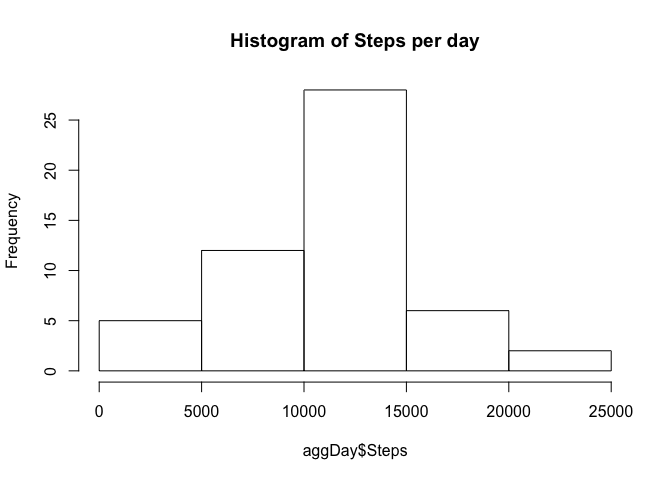
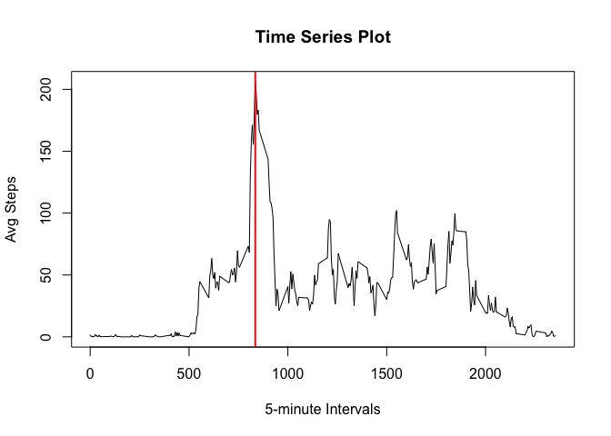
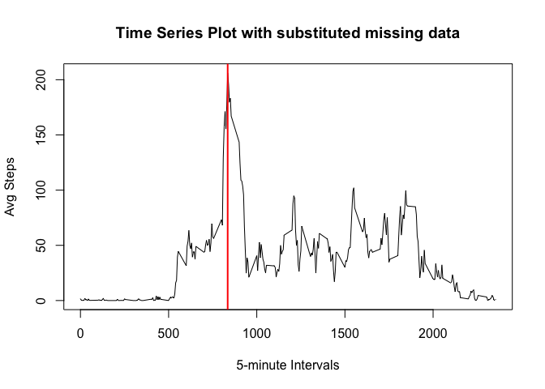
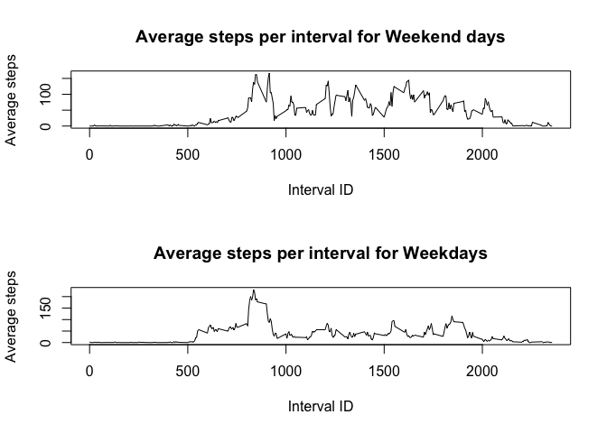

# Reproducible Research: Peer Assessment 1


## Intro
  
  **Reproducible Research Assignment 1**
  
  __From assignment:__  

> This assignment makes use of data from a personal activity monitoring device. This device collects data at 5 minute intervals through out the day. The data consists of two months of data from an anonymous individual collected during the months of October and November, 2012 and include the number of steps taken in 5 minute intervals each day.  

## Data
__From assignment:__ 

> The data for this assignment can be downloaded from the course web site:  
  > Dataset: [Activity monitoring data](https://d396qusza40orc.cloudfront.net/repdata%2Fdata%2Factivity.zip) [52K]
>  
  > The variables included in this dataset are:  
  > **steps**: Number of steps taking in a 5-minute interval (missing values are coded as NA)  
> **date**: The date on which the measurement was taken in YYYY-MM-DD format  
> **interval**: Identifier for the 5-minute interval in which measurement was taken  
> 
  > The dataset is stored in a comma-separated-value (CSV) file and there are a total of 17,568 observations in this dataset.  

## Loading and preprocessing the data

The file is zipped so the first this we need to do is unzip it. **Make sure to set your working directory correctly**
  
  
  ```r
  # Unzip archive
  unzip("activity.zip") 
  # Read in data file
  activity <- read.csv("activity.csv") 
  ```

Inspect the data to see what kind of processing needs to be done

```r
# Top 5 rows 
head(activity)
```

```
##   steps       date interval
## 1    NA 2012-10-01        0
## 2    NA 2012-10-01        5
## 3    NA 2012-10-01       10
## 4    NA 2012-10-01       15
## 5    NA 2012-10-01       20
## 6    NA 2012-10-01       25
```

```r
# Types of data
str(activity)     
```

```
## 'data.frame':	17568 obs. of  3 variables:
##  $ steps   : int  NA NA NA NA NA NA NA NA NA NA ...
##  $ date    : Factor w/ 61 levels "2012-10-01","2012-10-02",..: 1 1 1 1 1 1 1 1 1 1 ...
##  $ interval: int  0 5 10 15 20 25 30 35 40 45 ...
```

Let's change the date data into a character instead of a factor

```r
activity$date <- as.character(activity$date)
```


## What is mean total number of steps taken per day?
__From assignment:__  

> For this part of the assignment, you can ignore the missing values in the dataset.  
>  
> 1. Calculate the total number of steps taken per day  
> 2. If you do not understand the difference between a histogram and a barplot, research the difference between them. Make a histogram of the total number of steps taken each day  
> 3. Calculate and report the mean and median of the total number of steps taken per day  

Let's create  a dataframe with the steps aggregated by day and make a histogram

```r
aggDay <- aggregate(activity$steps, by= list(activity$date) , FUN=sum)
colnames(aggDay) [1] <- "Date"
colnames(aggDay) [2] <- "Steps"

# Top 5 rows 
head (aggDay) 
```

```
##         Date Steps
## 1 2012-10-01    NA
## 2 2012-10-02   126
## 3 2012-10-03 11352
## 4 2012-10-04 12116
## 5 2012-10-05 13294
## 6 2012-10-06 15420
```

```r
hist(aggDay$Steps,main = paste("Histogram of Steps per day"))
```



Let's Calculate the Mean

```r
aggDayMean <- mean(tapply(activity$steps,activity$date,sum), na.rm=TRUE)
aggDayMean
```

```
## [1] 10766.19
```

Let's Calculate the Median

```r
aggDayMedian <- median(tapply(activity$steps,activity$date,sum), na.rm=TRUE)
aggDayMedian
```

```
## [1] 10765
```

## What is the average daily activity pattern?
__From assignment:__  

> 1. Make a time series plot (i.e. 𝚝𝚢𝚙𝚎 = "𝚕") of the 5-minute interval (x-axis) and the average number of steps taken, averaged across all days (y-axis)  
> 2. Which 5-minute interval, on average across all the days in the dataset, contains the maximum number of steps?  

Let's create  a dataframe with the steps averaged by Interval and make a time series plot

```r
avgInterval <- aggregate(activity$steps, by= list(activity$interval) , FUN=mean, na.rm=TRUE)
colnames(avgInterval) [1] <- "Interval"
colnames(avgInterval) [2] <- "Steps"

# Top 5 rows 
head(avgInterval)
```

```
##   Interval     Steps
## 1        0 1.7169811
## 2        5 0.3396226
## 3       10 0.1320755
## 4       15 0.1509434
## 5       20 0.0754717
## 6       25 2.0943396
```

```r
plot(avgInterval$Interval, avgInterval$Steps, type="l", 
main = "Time Series Plot", 
xlab="5-minute Intervals", 
ylab="Avg Steps")

# Max steps in an interval
maxIntervalSteps <- max(avgInterval$Steps) 
# Row of data that max occurs on
maxIndex <- as.numeric(which(avgInterval$Steps == maxIntervalSteps)) 
# Interval number of max steps
maxInterval <- avgInterval$Interval[maxIndex]  
# Graph line on pervious chart
abline(v=maxInterval, lwd=2, col = "red") 
```



Interval that on average across all the days in the dataset, contains the maximum number of steps

```r
maxInterval
```

```
## [1] 835
```

## Imputing missing values

__From assignment:__  

> 1. Calculate and report the total number of missing values in the dataset (i.e. the total number of rows with 𝙽𝙰s)
> 2. Devise a strategy for filling in all of the missing values in the dataset. The strategy does not need to be sophisticated. For example, you could use the mean/median for that day, or the mean for that 5-minute interval, etc.  
> 3. Create a new dataset that is equal to the original dataset but with the missing data filled in.  
> 4. Make a histogram of the total number of steps taken each day and Calculate and report the mean and median total number of steps taken per day. Do these values differ from the estimates from the first part of the assignment? What is the impact of imputing missing data on the estimates of the total daily number of steps?  

Let's calculate and report the total number of missing values in the original dataset 

```r
missing.values <- is.na(activity)
sum(missing.values)
```

```
## [1] 2304
```

For the purpose of this assignment I'm going to use the average step by interval to fill in the missing values. I calculated these values above with the following code:

```r
avgInterval <- aggregate(activity$steps, by= list(activity$interval) , FUN=mean, na.rm=TRUE)
```

Let's build the new dataset and call it "activity.all"

```r
# Create  dataframe with existing data and add column for average steps for that interval
activity.all <- cbind(activity, avgInterval[,2])
names( activity.all)[4] <- c("avg")

# Add to dataframe and if the "steps" value is NA then use the "avg" value
activity.all$steps <- ifelse( is.na( activity.all$steps),  activity.all$avg,  activity.all$steps)

# Drop "avg" column 
activity.all <- subset(activity.all, select = -c(avg) ) 

# Top 5 rows  
head(activity.all) 
```

```
##       steps       date interval
## 1 1.7169811 2012-10-01        0
## 2 0.3396226 2012-10-01        5
## 3 0.1320755 2012-10-01       10
## 4 0.1509434 2012-10-01       15
## 5 0.0754717 2012-10-01       20
## 6 2.0943396 2012-10-01       25
```

I'm going to use the same code as above to calculate the new "total number of stepes taken each day" and the new mean and median.


```r
avgInterval.new <- aggregate(activity.all$steps, by= list(activity.all$interval) , FUN=mean)
colnames(avgInterval.new) [1] <- "Interval"
colnames(avgInterval.new) [2] <- "Steps"

head(avgInterval.new)
```

```
##   Interval     Steps
## 1        0 1.7169811
## 2        5 0.3396226
## 3       10 0.1320755
## 4       15 0.1509434
## 5       20 0.0754717
## 6       25 2.0943396
```

```r
plot(avgInterval.new$Interval, avgInterval.new$Steps, type="l", 
main = "Time Series Plot with substituted missing data", 
xlab="5-minute Intervals", 
ylab="Avg Steps")

# Max steps in an interval
maxIntervalSteps.new <- max(avgInterval.new$Steps)
# Row of data that max occurs on
maxIndex.new <- as.numeric(which(avgInterval.new$Steps == maxIntervalSteps.new))
# Interval number of max steps 
maxInterval.new <- avgInterval.new$Interval[maxIndex.new]
# Graph line on pervious chart
abline(v=maxInterval.new, lwd=2, col = "red")
```



Interval that on average across all the days in the dataset, contains the maximum number of steps

```r
maxInterval.new
```

```
## [1] 835
```

## Are there differences in activity patterns between weekdays and weekends?
__From assignment:__  

> 1. Create a new factor variable in the dataset with two levels – “weekday” and “weekend” indicating whether a given date is a weekday or weekend day.  
> 2. Make a panel plot containing a time series plot (i.e. 𝚝𝚢𝚙𝚎 = "𝚕") of the 5-minute interval (x-axis) and the average number of steps taken, averaged across all weekday days or weekend days (y-axis). See the README file in the GitHub repository to see an example of what this plot should look like using simulated data.  


```r
# Change date from a character to a date class
activity.all$date <- as.Date(activity.all$date)
# Add a True/False value for whether or not the day is a weekend day or a weekday
activity.all$weekend <- (weekdays(activity.all$date) %in% c("Sunday", "Saturday"))
# Create a dataset for each type of weekday
activity.weekend <- activity.all[activity.all$weekend == TRUE,]
activity.weekday <- activity.all[activity.all$weekend == FALSE,]

# Top 5 rows  
head(activity.weekend) 
```

```
##      steps       date interval weekend
## 1441     0 2012-10-06        0    TRUE
## 1442     0 2012-10-06        5    TRUE
## 1443     0 2012-10-06       10    TRUE
## 1444     0 2012-10-06       15    TRUE
## 1445     0 2012-10-06       20    TRUE
## 1446     0 2012-10-06       25    TRUE
```

```r
head(activity.weekday)
```

```
##       steps       date interval weekend
## 1 1.7169811 2012-10-01        0   FALSE
## 2 0.3396226 2012-10-01        5   FALSE
## 3 0.1320755 2012-10-01       10   FALSE
## 4 0.1509434 2012-10-01       15   FALSE
## 5 0.0754717 2012-10-01       20   FALSE
## 6 2.0943396 2012-10-01       25   FALSE
```

```r
# Create a data sets with the mean step by interval for both the weekdays and weekend days
weekend.steps <- aggregate(activity.weekend$steps, by= list(activity.weekend$interval) , FUN=mean)
weekday.steps <- aggregate(activity.weekday$steps, by= list(activity.weekday$interval) , FUN=mean)

# Name columns
colnames(weekend.steps) [1] <- "Interval"
colnames(weekend.steps) [2] <- "Steps"

colnames(weekday.steps) [1] <- "Interval"
colnames(weekday.steps) [2] <- "Steps"

# Top 5 rows  
head(weekend.steps)
```

```
##   Interval       Steps
## 1        0 0.214622642
## 2        5 0.042452830
## 3       10 0.016509434
## 4       15 0.018867925
## 5       20 0.009433962
## 6       25 3.511792453
```

```r
head(weekday.steps)
```

```
##   Interval      Steps
## 1        0 2.25115304
## 2        5 0.44528302
## 3       10 0.17316562
## 4       15 0.19790356
## 5       20 0.09895178
## 6       25 1.59035639
```

```r
# Plot the two data sets
par(mfrow=c(2,1))

plot( weekend.steps$Interval, 
weekend.steps$Steps, 
type="l",
main="Average steps per interval for Weekend days",
ylab="Average steps", 
xlab="Interval ID")

plot( weekday.steps$Interval, 
weekday.steps$Steps, 
type="l",
main="Average steps per interval for Weekdays",
ylab="Average steps", 
xlab="Interval ID")
```




As you can see in the plots the weekend days have a higher avereage number of steps in the later part of the day when compaired to the weekdays. Maybe this individual works Monday - Friday and is at their desk for most of the day.


